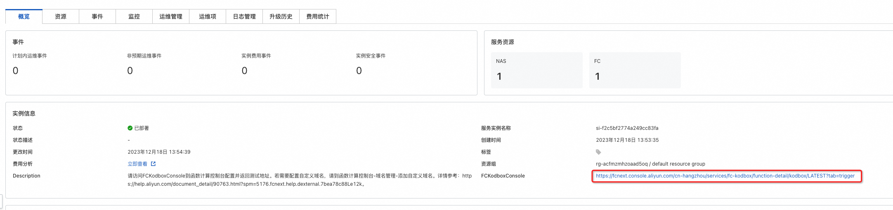
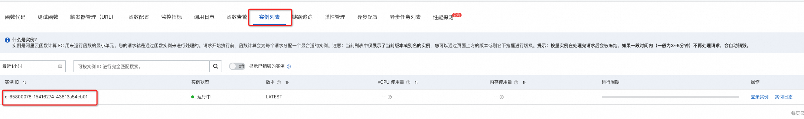

# 服务模板说明文档

## 服务说明

[Kodbox](https://kodcloud.com/product/kodbox/)是一款开源的在线文件管理系统。它可以帮助用户在本地或者服务器上搭建一个私有的云存储平台，
使用户可以通过浏览器访问和管理自己的文件。Kodbox提供了丰富的功能，包括文件上传、下载、预览、分享、权限管理等。
同时，Kodbox支持多种文件格式的在线预览，包括文档、图片、音视频等。Kodbox基于web技术，使用简单方便，
适用于个人用户或者小型团队共享文件。

快速上手流程，本示例对应的Git仓库地址：[kodbox-fc-demo](https://github.com/aliyun-computenest/kodbox-fc-demo)。

本示例会自动的构建计算巢服务，创建过程大约持续5分钟，当服务变成待提交后构建成功。

## 服务架构

本服务基于[函数计算FC](https://help.aliyun.com/zh/fc/)部署Kodbox。服务所属实例会创建一个NAS服务，并将其挂载到一个fc服务上。同时会创建一个fc的function，
用于部署Kodbox。

## 服务构建计费说明

测试本服务构建无需任何费用，创建服务实例涉及的费用参考服务实例计费说明。

## RAM账号所需权限

本服务需要对ECS、VPC等资源进行访问和创建操作，若您使用RAM用户创建服务实例，需要在创建服务实例前，对使用的RAM用户的账号添加相应资源的权限。添加RAM权限的详细操作，请参见[为RAM用户授权](https://help.aliyun.com/document_detail/121945.html)。
所需权限如下表所示。

| 权限策略名称                              | 备注                          |
|-------------------------------------|-----------------------------|
| AliyunECSFullAccess                 | 管理云服务器服务（ECS）的权限            |
| AliyunVPCFullAccess                 | 管理专有网络（VPC）的权限              |
| AliyunROSFullAccess                 | 管理资源编排服务（ROS）的权限            |
| AliyunRDSFullAccess                 | 管理云数据库服务(RDS)的权限            |
| AliyunSLBFullAccess                 | 管理负载均衡服务(SLB)的权限            |
| AliyunCloudMonitorFullAccess        | 管理云监控（CloudMonitor）的权限      |
| AliyunComputeNestUserFullAccess     | 管理计算巢服务（ComputeNest）的用户侧权限  |
| AliyunComputeNestSupplierFullAccess | 管理计算巢服务（ComputeNest）的服务商侧权限 |

## 服务实例计费说明

Kodbox在计算巢上的费用主要为FC服务费用，FC的费用详情参见：[FC服务费用说明](https://help.aliyun.com/zh/fc/product-overview/billing-overview)。

预估费用在创建实例时可实时看到。

## 服务实例部署流程

### 部署参数说明

| 参数组        | 参数项      | 示例            |
|------------|----------|---------------|
| 可用区配置      | 可用区      | cn-hangzhou-a |
| 基础资源配置（必填） | 专有网络实例ID | vpc-xxxx      |
| 基础资源配置（必填） | 交换机实例ID  | vsw-xxxx      |
| 基础资源配置（必填） | 安全组ID    | sg-xxxxx      |
| FC 配置      | 服务名称     | fc-kodbox     |

### 部署步骤
整体部署整体分为三个大步骤：部署计算巢服务实例 -> 访问fc控制台触发服务运行 -> 为访问kodbox服务配置自定义域名。配置完域名后即可通过域名访问kodbox。

0. 部署链接
   

1. 查看服务实例。服务实例创建成功后，部署时间大约需要6分钟。部署完成后，页面上可以看到对应的服务实例。
   

2. 通过服务实例访问FC，可以看到FC对应的http触发器，此时用户可以通过发送HTTP请求触发部署kodbox的函数执行。
   
   
   触发并执行成功后，可以看到kodbox的部署实例。
   
3. 为访问kodbox服务，您需要为该函数调用配置自定义域名，详情可参考：https://help.aliyun.com/zh/fc/configure-a-custom-domain-name
   
4. 步骤3完成后，您可进入fc控制台：高级功能——域名管理，复制域名并访问kodbox服务。
    
    
